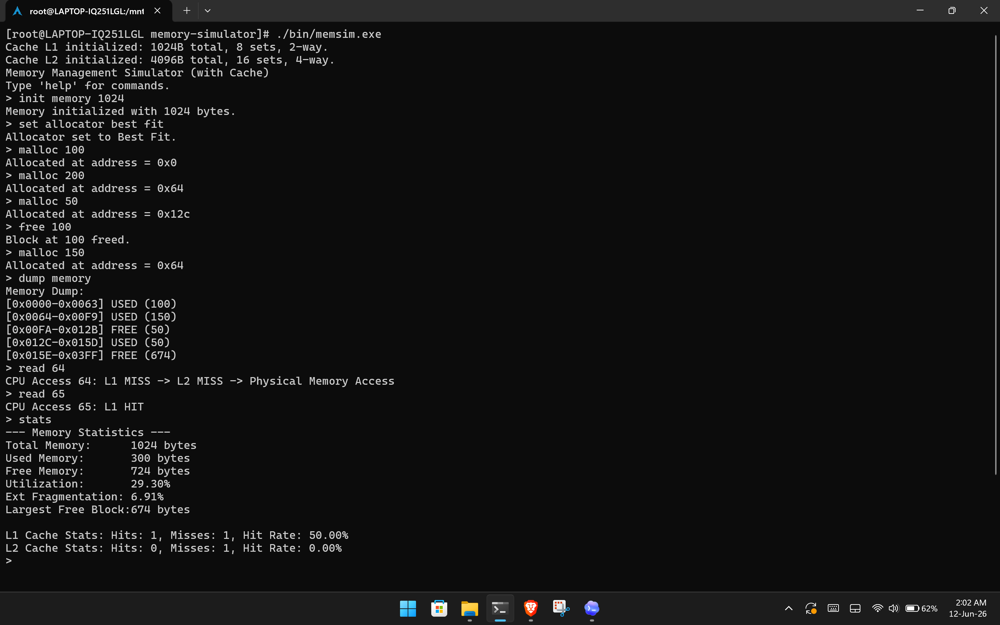

# Memory Management Simulator

A C++17 command-line simulator for operating-system memory management concepts. It demonstrates contiguous memory allocation, fragmentation analysis, block coalescing, and a two-level CPU cache simulation.



## Features

- First Fit, Best Fit, and Worst Fit memory allocation strategies.
- Block splitting during allocation.
- Adjacent free-block coalescing during deallocation.
- Memory dump with hexadecimal address ranges.
- Memory statistics including utilization and external fragmentation.
- L1/L2 cache simulation with FIFO replacement.
- Cache hit, miss, and hit-rate tracking.
- Interactive CLI with scripted test cases.

## Build

Using `make`:

```bash
make
```

Without `make`:

```bash
mkdir -p bin
g++ -std=c++17 -Wall -Wextra -g -Iinclude \
  src/main.cpp src/SimulatorShell.cpp \
  src/allocator/MemoryManager.cpp src/allocator/FirstFit.cpp \
  src/allocator/BestFit.cpp src/allocator/WorstFit.cpp \
  src/cache/cache.cpp \
  -o bin/memsim
```

For Windows bash environments, you can build:

```bash
mkdir -p bin
g++ -std=c++17 -Wall -Wextra -g -Iinclude \
  src/main.cpp src/SimulatorShell.cpp \
  src/allocator/MemoryManager.cpp src/allocator/FirstFit.cpp \
  src/allocator/BestFit.cpp src/allocator/WorstFit.cpp \
  src/cache/cache.cpp \
  -o bin/memsim.exe
```

## Run

```bash
./bin/memsim
```

or:

```bash
./bin/memsim.exe
```

## Quick Demo

After running the program, enter:

```text
init memory 1024
set allocator best fit
malloc 100
malloc 200
malloc 50
free 100
malloc 150
dump memory
read 64
read 65
stats
exit
```

## Commands

| Command | Description |
| --- | --- |
| `init memory <size>` | Initialize simulated RAM |
| `set allocator <strategy>` | Select `first fit`, `best fit`, or `worst fit` |
| `malloc <size>` / `alloc <size>` | Allocate memory |
| `free <address>` | Free a memory block |
| `dump memory` | Display memory layout |
| `read <address>` / `write <address>` | Simulate cache-backed memory access |
| `reset cache` | Clear cache contents and cache stats |
| `stats` | Show memory and cache statistics |
| `exit` | Close the simulator |

## Tests

Run all tests:

```bash
./run_tests.sh
```

Run individual tests:

```bash
./bin/memsim < tests/fragmentation_test.txt
./bin/memsim < tests/cache_test.txt
./bin/memsim < tests/strategy_comparison_test.txt
```

Use `./bin/memsim.exe` if you built the `.exe` version.

## Documentation

For the full explanation, architecture, algorithms, test cases, limitations, and conclusion, read:

[Project Report](docs/ProjectReport.md)

Additional design notes are available in:

[Design Document](docs/DesignDocument.md)
